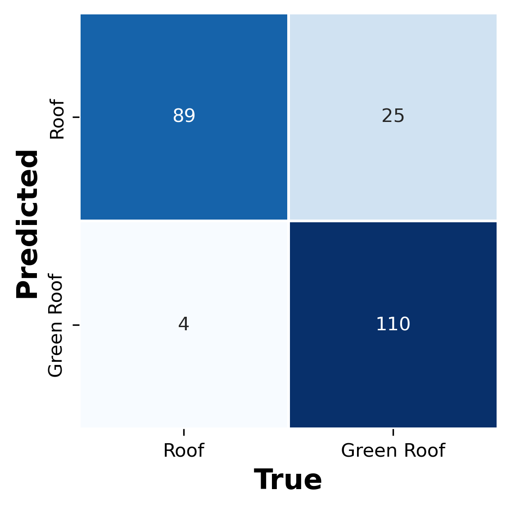
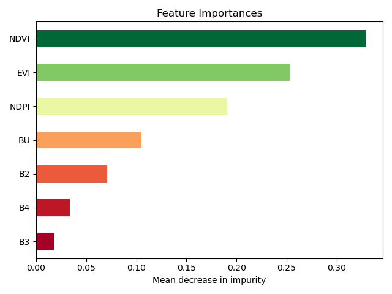
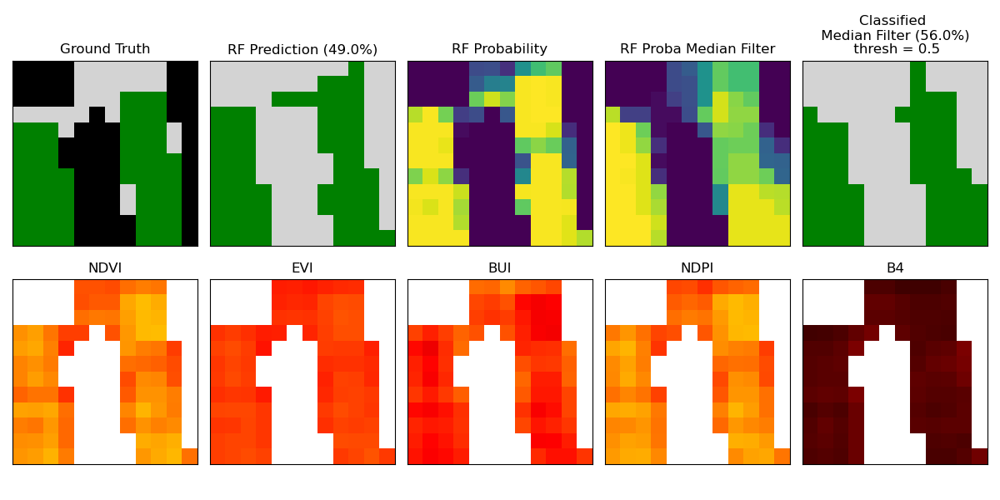

# Urban Green Roof Detection and Monitoring using Spectral Indices from Sentinel-2 Imagery

## Workflow

1. Programmatic Sentinel-2 Imagery Aquisition and Index calculations on Google Earth Engine (GEE)
2. Data preprocessing and training data preparation
3. Spectral Analysis (may remove)
4. Random Forest model Training, Validation and Assessment

## Spectral Indices Employed:
Here is the numbered list with each item followed by its full name or corresponding Google Earth Engine (GEE) band:

| Vegetation Index | Full Name                                           | Built-up Index       | Full Name                                        |
|------------------|-----------------------------------------------------|----------------------|--------------------------------------------------|
| SAVI             | Soil Adjusted Vegetation Index                      | NBI                  | Normalized Built-up Index                        |
| NDVI             | Normalized Difference Vegetation Index              | BU                   | Built-up Index                                   |
| EVI              | Enhanced Vegetation Index                           | MBI                  | Modified Built-up Index                          |
| NDPI             | Normalized Difference Phenology Index               | IBI                  | Index-based Built-up Index                       |
| ENDISI           | Enhanced Normalized Difference Impervious Surface Index | BSI              | Bare Soil Index                                  |
|                  |                                                     |                      |                                                  |

## Preliminary Results

Results as of 23 June, 2025

| Class        | Precision | Recall | F1-Score | Support |
|--------------|-----------|--------|----------|---------|
| Roof         | 0.88      | 0.82   | 0.85     | 502     |
| Green Roof   | 0.83      | 0.89   | 0.86     | 502     |
| **Accuracy** |           |        | 0.86     | 1004    |
| Macro Avg    | 0.86      | 0.86   | 0.86     | 1004    |
| Weighted Avg | 0.86      | 0.86   | 0.86     | 1004    |

## Binary Classification of Rooftop (Green Roof vs Roof)

## Roadmap

1. Increase repository of green roof training data
2. Apply Convolutional Neural Networks (CNNs) for semantic segmentation
3. Explore pan-sharpaning techniques to improve Sentinel-2 Data Resolution