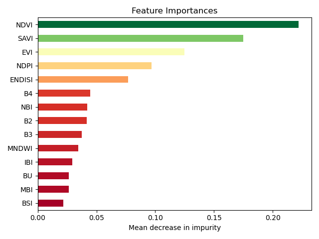

# Urban Green Roof Detection and Monitoring using Spectral Indices from Sentinel-2 Imagery

## Workflow

1. Programmatic Sentinel-2 Imagery Aquisition and Index calculations on Google Earth Engine (GEE)
2. Data preprocessing and training data preparation
3. Spectral Analysis (may remove)
4. Random Forest model Training, Validation and Assessment

## Spectral Indices Employed:
Here is the numbered list with each item followed by its full name or corresponding Google Earth Engine (GEE) band:

1. **SAVI** – Soil Adjusted Vegetation Index
2. **NDVI** – Normalized Difference Vegetation Index
3. **EVI** – Enhanced Vegetation Index
4. **NDPI** – Normalized Difference Phenology Index *(Note: not standard; sometimes used for vegetation dynamics)*
5. **ENDISI** – Enhanced Normalized Difference Impervious Surface Index *(likely a custom or variant index)*
6. **NBI** – Normalized Built-up Index
7. **BU** – Built-up Index *(may refer to a simplified built-up mask or raw band-based threshold)*
8. **B2** – Sentinel-2 Band 2 (Blue, 490 nm)
9. **B4** – Sentinel-2 Band 4 (Red, 665 nm)
10. **MNDWI** – Modified Normalized Difference Water Index
11. **B3** – Sentinel-2 Band 3 (Green, 560 nm)
12. **MBI** – Modified Built-up Index 
13. **IBI** – Index-based Built-up Index
14. **BSI** – Bare Soil Index

## Preliminary Results

Results as of 23 June, 2025

| Class        | Precision | Recall | F1-Score | Support |
|--------------|-----------|--------|----------|---------|
| Roof         | 0.88      | 0.82   | 0.85     | 502     |
| Green Roof   | 0.83      | 0.89   | 0.86     | 502     |
| **Accuracy** |           |        | 0.86     | 1004    |
| Macro Avg    | 0.86      | 0.86   | 0.86     | 1004    |
| Weighted Avg | 0.86      | 0.86   | 0.86     | 1004    |

## Binary Classification of Rooftop (Green Roof vs Roof)

## Roadmap

1. Increase repository of green roof training data
2. Apply Convolutional Neural Networks (CNNs) for semantic segmentation
3. Explore pan-sharpaning techniques to improve Sentinel-2 Data Resolution