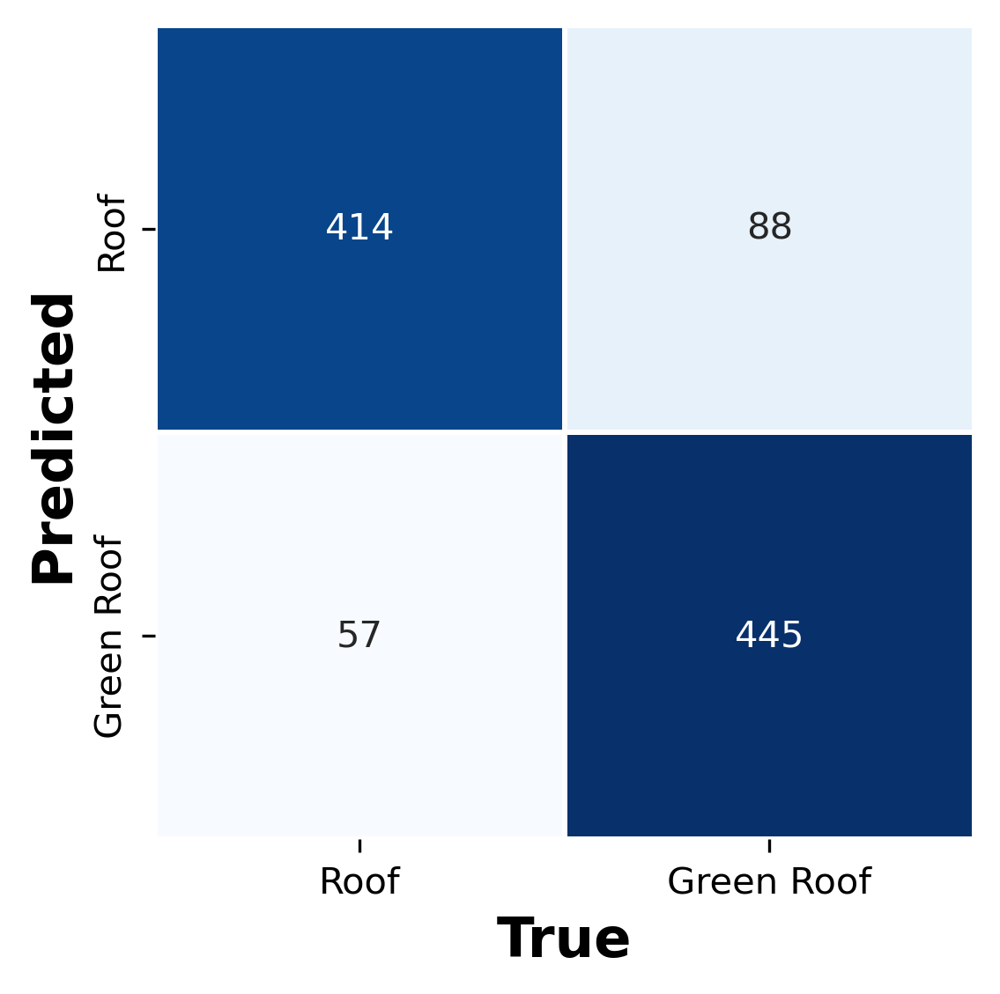

# Urban Green Roof Detection and Monitoring using Spectral Indices from Sentinel-2 Imagery

## Workflow

1. Programmatic Sentinel-2 Imagery Aquisition and Index calculations on Google Earth Engine (GEE)
2. Data preprocessing and training data preparation
3. Spectral Analysis (may remove)
4. Random Forest model Training, Validation and Assessment

## Spectral Indices Employed:
- Normalized Difference Vegetation Index (NDVI)
- Enhanced Vegetation Index (EVI)
- Built-up Index (BUI)
- Normalized Difference Water Index (NDWI)

## Preliminary Results

| Metric     | Roof  | Green Roof |
|------------|-------|------------|
| Precision  | 0.96  | 0.81       |
| Recall     | 0.78  | 0.96       |
| F1-Score   | 0.86  | 0.88       |
| Support    | 114   | 114        |

## Binary Classification of Rooftop (Green Roof vs Roof)

